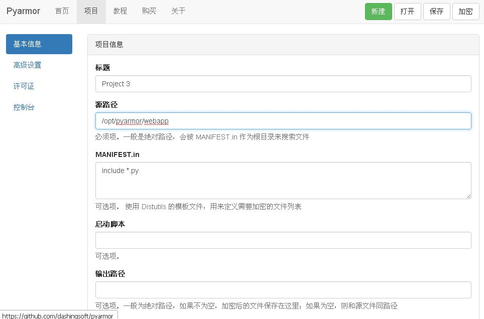
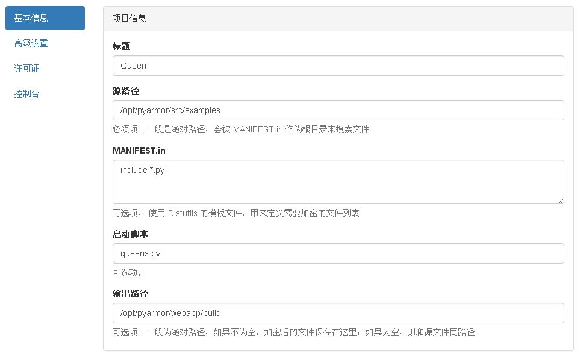
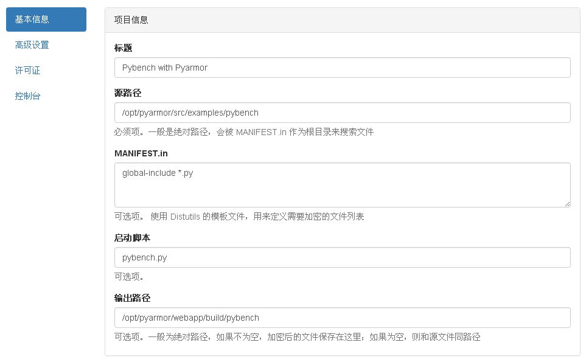
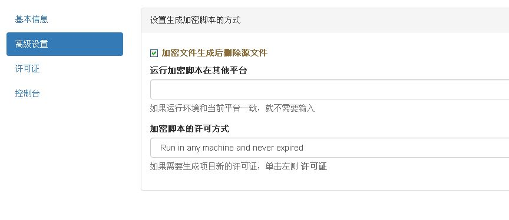
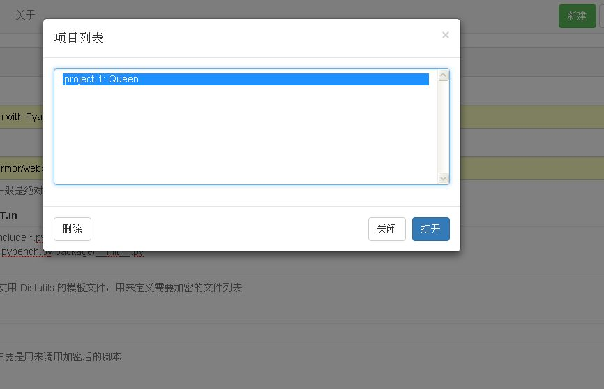
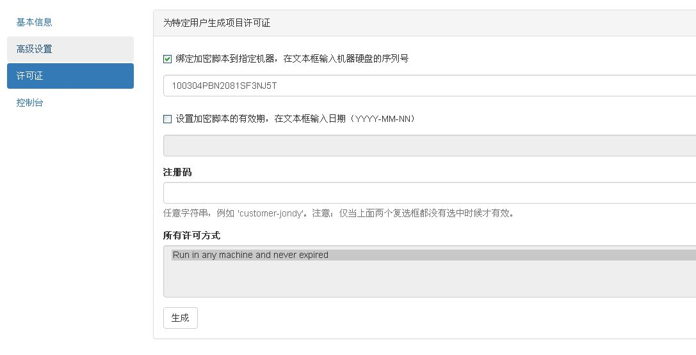
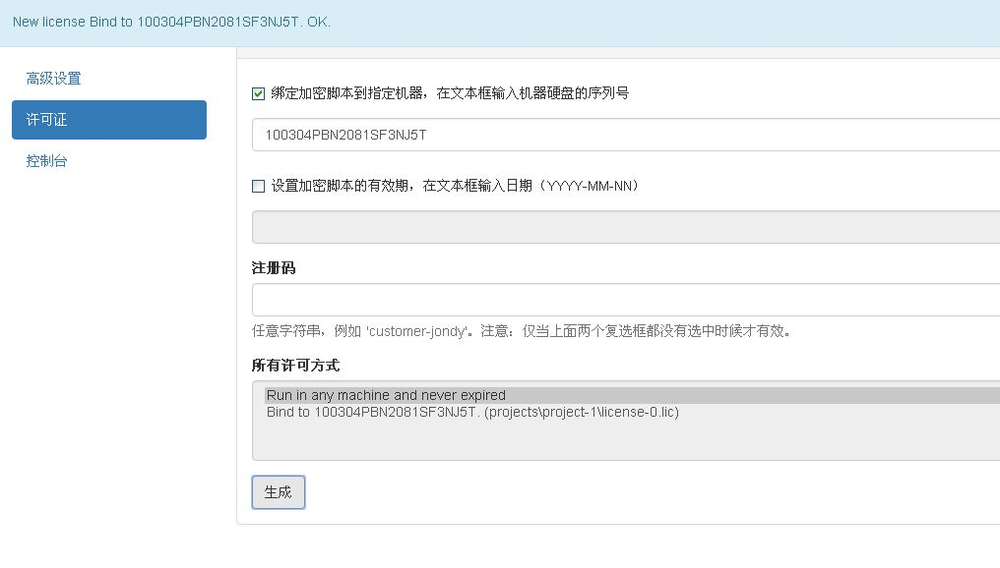
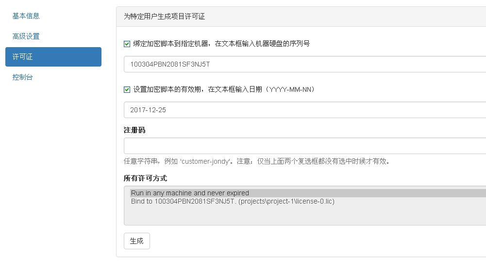

# Pyarmor WebApp 使用教程

Pyarmor 是一个导入和运行加密 Python 脚本的命令行工具。

WebApp 是网页版的图形界面，它通过启动一个本地的 Web 服务来调用 Pyarmor 的提供的功能。

本教程主要是讲解如何使用 WebApp。

## 下载

首先是下载 Pyarmor WebApp，下载地址： <https://github.com/dashingsoft/pyarmor/releases/download/v3.1.3/pyarmor-webapp.zip>

解压下载文件到任意目录，例如 **/opt**。本教程后面的章节都是以 **/opt** 作为 WebApp 的安装路径，运行里面的例子需要把它替换成为实际的安装路径。

## 启动

打开文件夹 **/opt/pyarmor/webapp**，双击 **start-server.bat** for Windows 或者 **start-server.sh** for Linux

也可以通过命令行方式启动，假定 python 的安装路径为 **D:/tools/Python27**

```
cd /opt/pyarmor/webapp
D:/tools/Python27/python server.py

```

这条命令会打开一个控制台，显示服务器的行为动态，同时本机默认的浏览器会自动打开一个网页，这就是 WebApp。

单击 **Project**, 进入 Pyarmor 的世界



我们下面的操作主要就是在这个网页里面进行的，另外还需要打开一个命令窗口执行相关的 Python 命令。

### 演示模式

如果在项目页面的右上角有个 **演示版本** 的按钮，那就是说，WebApp 现在只能演示功能。通常情况下，有两种方式会进入演示模块

  * [Pyarmor WebApp 官方在线版](http://pyarmor.dashingsoft.com:9096)
  * 直接在文件夹打开 **/opt/pyarmor/webapp/index-zh.html**

## 使用方法

下面通过四个例子来演示 WebApp 的主要功能：

* 第一个例子最简单，运行一个加密的脚本
* 第二个稍微复杂一些，演示如何导入加密的模块和包（Package）
* 第三个例子主要是演示如何绑定加密脚本到指定机器
* 最后一个例子演示如何设置加密脚本的有效期

### 运行加密脚本

在这个例子中，将会加密 [/opt/pyarmor/src/examples/queens.py](../src/examples/queens.py)，然后运行加密后的脚本。

1. 加密

    * 按照下图输入 **标题**, **源路径**, **包裹脚本**, **输出路径**
    * 点击按钮 **加密**

    

    关于 **包裹脚本** 的格式，参考附录 [包裹脚本](#包裹脚本)

    加密成功之后在目录 **/opt/pyarmor/webapp/build** 下面会有加密脚本 **queens.pye**，包裹脚本 **main.py** 以及相关的辅助文件。

2. 运行

    在命令窗口执行里面的命令

``` bash
    # 进入输出目录
    cd /opt/pyarmor/webapp/build

    # 执行包裹脚本，并且传入命令行参数: "6"
    python main.py 6

```

3. 包裹脚本 **main.py** 会执行加密后的 **queens.pye**，它的内容如下

```
    import pyimcore
    from pytransform import exec_file
    exec_file('queens.pye')

```

4. 最后点击按钮 **保存**，保存项目信息，后面的例子中还会用到这个项目。

### 导入加密模块

第二个例子稍微复杂一些，使用一个真实的包 [/opt/pyarmor/src/examples/pybench](../src/examples/pybench) 。这是
一个用来测试 Python 实现性能的小工具包，用在这里最合适不过了。

在这个例子中，将会加密 **pybench** 中的所有 ".py" 文件，除了主文
件 [pybench.py](../src/examples/pybench/pybench.py) 和
"package/\__init__.py"，然后运行脚本 **pybench.py**，它可以像正常方式一样，使用导入后的加密模块。

当然也可以加密包文件 "package/\__init__.py", 基于性能方法的考虑，不建议加密这个文件。

至于为什么不加密主文件 [pybench.py](../src/examples/pybench/pybench.py), 留个小问题，在这个例子的最后揭晓答案。

#### 加密

* 拷贝整个包 **/opt/pyarmor/src/examples/pybench** 到 **/opt/pyarmor/webapp/build**，加密后的脚本也会存放在这里

```
    cp -a /opt/pyarmor/src/examples/pybench /opt/pyarmor/webapp/build

```

* 点击按钮 **新建**，创建一个新的项目
* 按照下图内容输入 **标题**, **源路径**, **MANIFEST.in**

    

    关于 **MANIFEST.in** 的格式，参考附录 [MANIFEST.in](#manifest.in)

* 点击左边的 **高级设置**

* 选中 **加密文件生成后删除源文件**

    

* 点击按钮 **保存**，保存修改后的项目

* 点击按钮 **加密**

    因为 **输出路径** 是空，所有加密后的脚本会和源文件一样存放在 **源路径** **/opt/pyarmor/webapp/build/pybench** 下面，并且删除了相应的 ".py" 源文件。

#### 运行

* 打开文件夹 **/opt/pyarmor/webapp/build/pybench**

    在这个文件夹中，只有一个 ".py" 文件 **pybench.py**，其他的都是 ".pye"

* 导入模块 **pyimcore**

    模块 **pyimcore** 负责导入加密模块，导入后的加密模块使用方式和之前没有任何改变。

    使用编辑器打开 **pybench.py**，在第一个代码行（第13行）后面，如下所示，插入一行（第14行）

```
    13: from __future__ import print_function
    14: import pyimcore
```

* 运行脚本 pybench.py

```
    cd /opt/pyarmor/webapp/build/pybench
    python pybench.py
```

现在回答开始的问题，事实上，也可以把主脚本 **[pybench.py](../src/examples/pybench/pybench.py)** 加密，具体怎么做，参考第一个例子（提示：[包裹脚本](#包裹脚本)）

### 绑定加密脚本到指定机器

这个例子演示如何绑定加密脚本到当前机器，在之前首先要得到本机的硬盘序列号。Pyarmor 提供了一个命令可以直接获取本机的硬盘序列号，打开一个命令行窗口，执行下面的命令

```
    cd /opt/pyarmor/src
    python pyarmor.py hdinfo
    Harddisk's serial number is '100304PBN2081SF3NJ5T'
```

#### 生成许可证

我们继续使用第一个例子中的项目 **Queen**，加密后的脚本已经存放在 **/opt/pyarmor/webapp/build**，可以直接在这个例子里面使用。

* 点击按钮 **打开**，弹出项目列表对话框
* 在列出的项目中选中 **project-1:Queen**，然后点击对话框下方按钮 **打开**

    

* 点击左侧 **许可证**

* 选中 **绑定加密脚本到指定机器**，在下面的文本框输入 **100304PBN2081SF3NJ5T**

    

* 点击下面的按钮 **生成**

    

    如上图所示，新的许可文件会显示在 **所有许可方式** 的列表中，上图中例子是 **Bind to 100304PBN2081SF3NJ5T (projects\\project-1\\license-0.lic)**

    小括号里面的内容是许可证的文件名称，加上安装路径，全路径的文件名称是 **/opt/pyarmor/webapp/projects/project-1/license-0.lic**

#### 使用新的许可证

使用新的许可证只需要使用新的许可证替换默认许可证 **/opt/pyarmor/webapp/build/license.lic** 即可

```
    cp /opt/pyarmor/webapp/projects/project-1/license-0.lic /opt/pyarmor/webapp/build/license.lic
```

打开命令行窗口，再次运行

```
    cd /opt/pyarmor/webapp/build
    python main.py 6

```

在本机可以正常运行，但是在其他机子上，就会出错。

### 设置加密脚本的有效期

这个例子演示如何设置加密脚本的有效期，我们继续上面的操作。

* 点击左侧 **许可证**
* 选中 **设置加密脚本的有效期**，在下面的文本框输入 **2017-12-25**

    

* 点击下面的按钮 **生成**


和上面的例子一样，新的许可文件会显示在 **所有许可方式** 的列表中，用新的许可文件替换旧的即可。

打开命令窗口，再次运行

```
    cd /opt/pyarmor/webapp/build
    python main.py 6

```
这个加密脚本只能在本机运行到2071年的圣诞节。在圣诞节之后，就会出错。


## 附录

### 包裹脚本

包裹脚本主要用来直接调用加密后脚本，它的标准格式为

```
    NAME:ALIAS.py
```

NAME 是主脚本的名称，ALIAS.py 是 WebApp 输出的包裹脚本的文件名称。 例如
**pybench:main.py**, 在加密后的输出路径里面，将会生成包裹脚本
**main.py** ，它的内容如下

```
import pyimcore
from pytransform import exec_file
exec_file('pybench.pye')
```

注意最后一行的 **pybench.pye**

如果 ALIAS 和 NAME 相同，可以简化为

```
    NAME

```

### MANIFEST.in

这个模板完全参照 Python Distutils 里面相应的文件，它用来列出项目中需要加密的文件。例如

```
include *.py
recursive-include examples *.py

```

上面的例子一看就能明白： 所有在项目 **源路径** 下面的 py 文件，递归所有在项目子目录 **examples** 下面的 py 文件。


模板支持的命令如下表所示（从 Python 帮助文件拷贝而来）

```
              Command                             Description
---------------------------------------------------------------------------------------------------------------------------
include pat1 pat2 ...                include all files matching any of the listed patterns
exclude pat1 pat2 ...                exclude all files matching any of the listed patterns
recursive-include dir pat1 pat2 ...  include all files under dir matching any of the listed patterns
recursive-exclude dir pat1 pat2 ...  exclude all files under dir matching any of the listed patterns
global-include pat1 pat2 ...         include all files anywhere in the source tree matching — & any of the listed patterns
global-exclude pat1 pat2 ...         exclude all files anywhere in the source tree matching — & any of the listed patterns
prune dir                            exclude all files under dir
graft dir                            include all files under dir

```

需要注意的是在 Pyarmor WebApp 中，MANIFEST.in 里面的路径都是相对于项目 **源路径**，并且不支持绝对路径。

