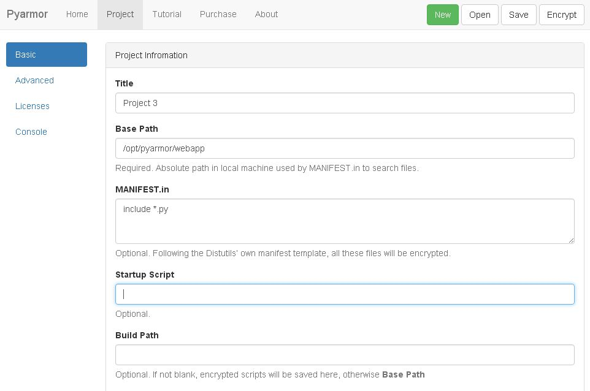
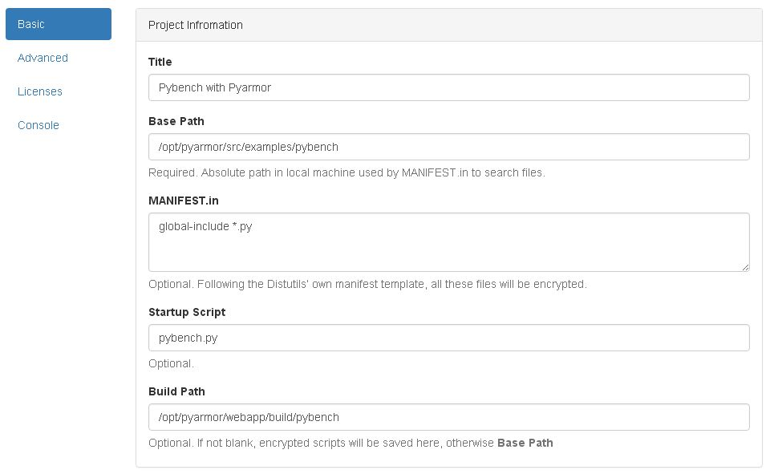
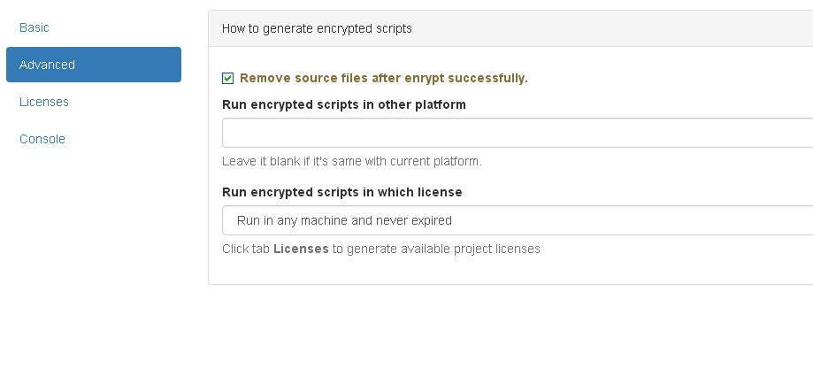

# Pyarmor WebApp Tutorial

Pyarmor is a tool used to run and import encrypt python scripts.

WebApp is a one-page web application. It's gui interface of
Pyarmor. This tutorial mainly show the usage of WebApp.

## Download

First download Pyarmor WebApp from <https://github.com/dashingsoft/pyarmor/releases/download/v3.1.2/pyarmor-webapp.zip>

Then extract it to any path, for example **/opt**. In this turorial,
**/opt** will be as the installed path of Pyarmor WebApp. Replace it
with real path when run these examples.

## Startup

Enter path **/opt/pyarmor/webapp**, double click **start-server.bat** for Windows or **start-server.sh** for Linux.

Or start WebApp from command line, suppose python installed at **D:/tools/Python27**

```
cd /opt/pyarmor/webapp
D:/tools/Python27/python server.py

```

It will lanch a console window, at the same time a web page will be
opened in the web browser. This is WebApp.

Click tab **Project**, enter the graphic world of Pyarmor.



## Usage

Here are 4 cases to show basic usage:

* First case it's to run a simple encrypted script
* Then a more complicated example, used encrypted module and package.
* Next one is to bind encrypted scripts to some machine
* Last is to expire encrypted scripts on some day

### Run encrypted script

This example show how to encrypt script [/opt/pyarmor/src/examples/queens.py](../src/examples/queens.py) and run it.

1. Encrypt script

    * Type **Title**, **Base Path**, **Start Wrapper Script**, **Build Path** as the following figure
    * Click button **Encrypt**

    

    It's easy to understand except **Startup Wrapper Script**, refer to appendix [Startup Wrapper Script](#startup-wrapper-script)

2. Run it

```
    # Encrypted files are saved here
    cd /opt/pyarmor/webapp/build
    
    # Run ecnrypted queens.pye with arguments "6"
    python main.py 6

    # Content of main.py
    cat main.py
    
    import pyimcore
    from pytransform import exec_file
    exec_file('queens.pye')
  
```

3. Save project

    * Click button **Save**

### Import encrypted module

[/opt/pyarmor/src/examples/pybench](../src/examples/pybench) is a
collection of tests that provides a standardized way to measure the
performance of Python implementations. This example show how to use
encrypted pybench except main
script [pybench.py](../src/examples/pybench/pybench.py) and
package/\__init__.py

It's no problem to encrypt package/\__init__.py, but not recommended for the sake of performance.

Why not encrypt [pybench.py](../src/examples/pybench/pybench.py), don't worry, you'll understand soon. Now start this example.

1. Copy whole directory **/opt/pyarmor/src/examples/pybench** to **/opt/pyarmor/webapp/build**

```
    cp -a /opt/pyarmor/src/examples/pybench /opt/pyarmor/webapp/build
```

2. Click button **New** to create a new project

3. Type **Title**, **Base Path**, **MANIFEST.in** as the following figure



    Note that refer to appendix [MANIFEST.in](manifest.in)
    
4. Click right side tab **Advanced**
5. Check **Remove source files after enrypt successfully.**



6. Click button **Encrypt**

1. Open pybench.py
2. Insert one line "import pyimcore"
3. Run pybench.py

Of course, it's possible to encrypt
**[pybench.py](../src/examples/pybench/pybench.py)** either, you can
try it by yourself. A tip [Startup Wrapper Script](#startup-wrapper-script)

* Click button **Save**

### Bind encrypted script to one machine

Get serial number of harddisk

```
    cd /opt/pyarmor/src
    python pyarmor.py hdinfo
    Harddisk's serial number is '100304PBN2081SF3NJ5T'
```

* Click button **Open**
* Select **project-1:Queen**, then click **Open** in the dialog
* Click right side tab **Licenses**
* Check **Run encrypted scripts in special machine, type harddisk serial number of target machine**
* Type **abcdefg** in the below text box
* Click bottom button **Generate**
* Click right side tab **Advanced**
* Click list **Run encrypted scripts in which license**, select **Bind**
* Click button **Save**

* Click button **Encrypt**

Run it again

```
cd /opt/pyarmor/webapp/build
python main.py
```
Copy build to other machine, run main.py, it would not work.

### Expired encrypted script on some day

* Click right side tab **Licenses**
* Check **Expired encrypted scripts at some point, type expired date (YYYY-MM-NN)**
* Type **2017-12-05** in the below text box
* Click bottom button **Generate**

New license will be list in **Available Licenses**, the filename will be shown

* Replace **/opt/pyarmor/webapp/build/license.lic** with this file

Run it again

If time is 2018, it would not work.

## Appendix

### Startup Wrapper Script

It used to generate a python script to call the encrypted script. The
basic of format:

> NAME:ALIAS.py

NAME means main script name, ALIAS.py is target filename. For example,
if Startup Wrapper Script is **pybench:main.py**, after click button
Encrypt, **main.py** will be generated. Its content would be

```
import pyimcore
from pytransform import exec_file
exec_file('pybench.pye')
```

Note that **pybench.pye** in the last line.

There is a simple format

> NAME

It equals

> NAME:NAME.py

### MANIFEST.in

The manifest template has one command per line, where each command
specifies a set of files to include or exclude from the encrypted
project. For an example, let’s look at the Distutils’ own manifest
template:

```
include *.txt
recursive-include examples *.txt *.py
prune examples/sample?/build

```

The meanings should be fairly clear: include all files in the project
path matching *.txt, all files anywhere under the examples directory
matching *.txt or *.py, and exclude all directories matching
examples/sample?/build. All of this is done after the standard include
set, so you can exclude files from the standard set with explicit
instructions in the manifest template.


|              Command               |              Description                                                              |
|------------------------------------|---------------------------------------------------------------------------------------|
|include pat1 pat2 ...               | include all files matching any of the listed patterns                                 |
|exclude pat1 pat2 ...               | exclude all files matching any of the listed patterns                                 |
|recursive-include dir pat1 pat2 ... | include all files under dir matching any of the listed patterns                       |
|recursive-exclude dir pat1 pat2 ... | exclude all files under dir matching any of the listed patterns                       |
|global-include pat1 pat2 ...        | include all files anywhere in the source tree matching — & any of the listed patterns |
|global-exclude pat1 pat2 ...        | exclude all files anywhere in the source tree matching — & any of the listed patterns |
|prune dir                           | exclude all files under dir                                                           |
|graft dir                           | include all files under dir                                                           |


The patterns here are Unix-style “glob” patterns: * matches any
sequence of regular filename characters, ? matches any single regular
filename character, and [range] matches any of the characters in range
(e.g., a-z, a-zA-Z, a-f0-9_.). The definition of “regular filename
character” is platform-specific: on Unix it is anything except slash;
on Windows anything except backslash or colon.

### Demo Mode

If there is a button **Demo Version** in the top right corner of tab
**Project**, it is to say, Oh, what I'm doing is not reality. The
purpose of this mode is only to help users to understand the functions
of Pyarmor, there are 2 cases:

  * [Pyarmor official online demo](http://pyarmor.dashingsoft.com)
  * Open **/opt/pyarmor/webapp/index.html** in web browser directly.

